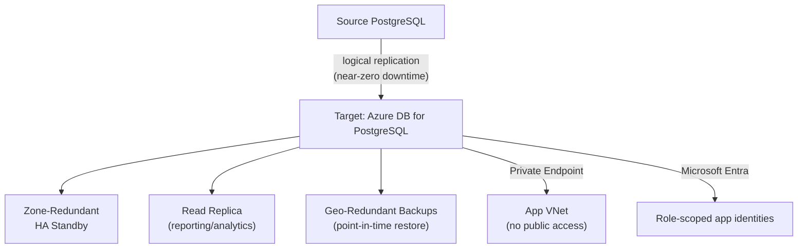

# Azure Database for PostgreSQL — Migration & High Availability Lab

Migrating a database and keeping it highly available afterward are the same discipline applied at two different moments — both come down to PostgreSQL's write-ahead log (WAL). This lab covers a near-zero-downtime migration via logical replication, zone-redundant HA, read replicas, point-in-time restore, a real slow-query fix, and locking down identity and network access.

Companion lab for the article [Configuring and Migrating to Azure Database for PostgreSQL](https://raphaelgmomoh.pages.dev/articles/azure-postgresql-migration-and-high-availability).

Every `az` command in this repo was verified against a real, locally installed Azure CLI (`az postgres flexible-server --help`) before being committed — not copied from memory.

---

## Architecture



---

## Repository Structure

```text
.
├── README.md
└── src/
    ├── migration/
    │   ├── 01-dump-restore.sh          # Simple path: pg_dump / pg_restore
    │   └── 02-logical-replication.sh   # Near-zero-downtime migration
    ├── bicep/
    │   └── main.bicep                  # Flexible Server with zone-redundant HA + backup config
    ├── experiments/
    │   └── measure-failover-rto.sh     # Times a real forced failover, appends to a results CSV
    ├── performance/
    │   ├── slow-query-diagnosis.sql    # EXPLAIN ANALYZE walkthrough
    │   └── enable-pgbouncer.sh
    └── security/
        ├── entra-admin-setup.sh
        ├── private-endpoint-setup.sh
        └── role-based-access.sql
```

---

## Quick Start

### 1. Provision the server (Bicep)

```bash
az deployment group create \
  --resource-group rg-database \
  --template-file src/bicep/main.bicep \
  --parameters adminPassword='<a-strong-password>'
```

### 2. Migrate a database

Small database, a maintenance window is fine:

```bash
./src/migration/01-dump-restore.sh source-server.postgres.database.azure.com target-server.postgres.database.azure.com production_db
```

Production database, can't take extended downtime:

```bash
./src/migration/02-logical-replication.sh source-server.postgres.database.azure.com target-server.postgres.database.azure.com production_db
```

Add `--dry-run` as a fourth argument to just print Step 1's commands instead of executing them, for review before the first real run.

### 3. Measure real failover RTO (non-prod only)

```bash
./src/experiments/measure-failover-rto.sh rg-database pg-prod-primary
```

Forces a failover with `az postgres flexible-server restart --failover Forced`, then polls until the server reports `Ready` again and records the real elapsed seconds to `src/results/failover-rto-results-<date>.csv` — matching the measured-RTO discipline in the companion [Alibaba Cloud DR lab](https://github.com/raphgm/alibaba-cloud-disaster-recovery-lab).

### 4. Diagnose and fix a slow query

```bash
psql "host=<server> dbname=production_db user=dbadmin sslmode=require" -f src/performance/slow-query-diagnosis.sql
```

### 5. Lock down identity and network access

```bash
./src/security/entra-admin-setup.sh rg-database pg-prod-primary "db-admins-group" "<entra-group-object-id>"
./src/security/private-endpoint-setup.sh rg-database pg-prod-primary vnet-app snet-data
psql "host=<server> dbname=production_db user=dbadmin sslmode=require" -f src/security/role-based-access.sql
```

---

## License

MIT — use it, fork it, adapt it to your own environment.
